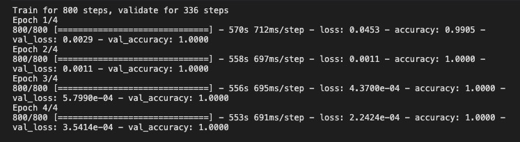
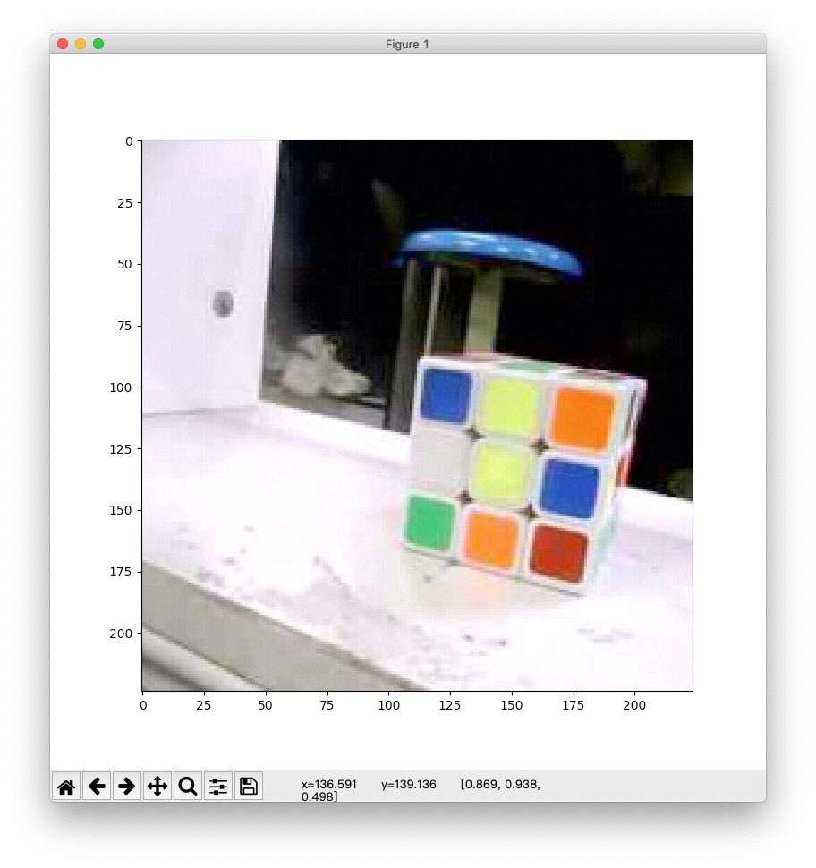
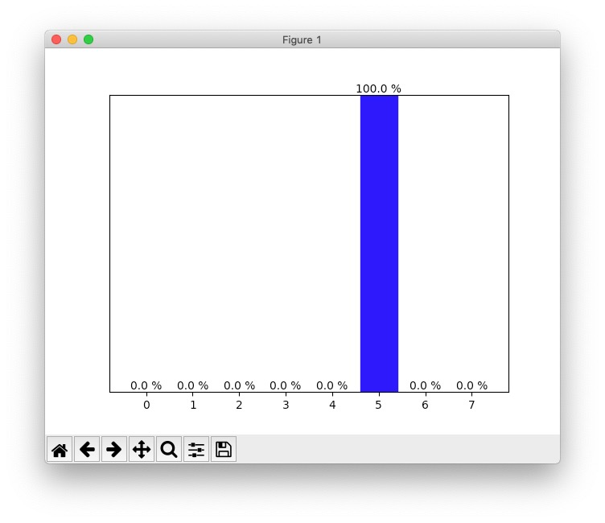
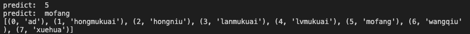
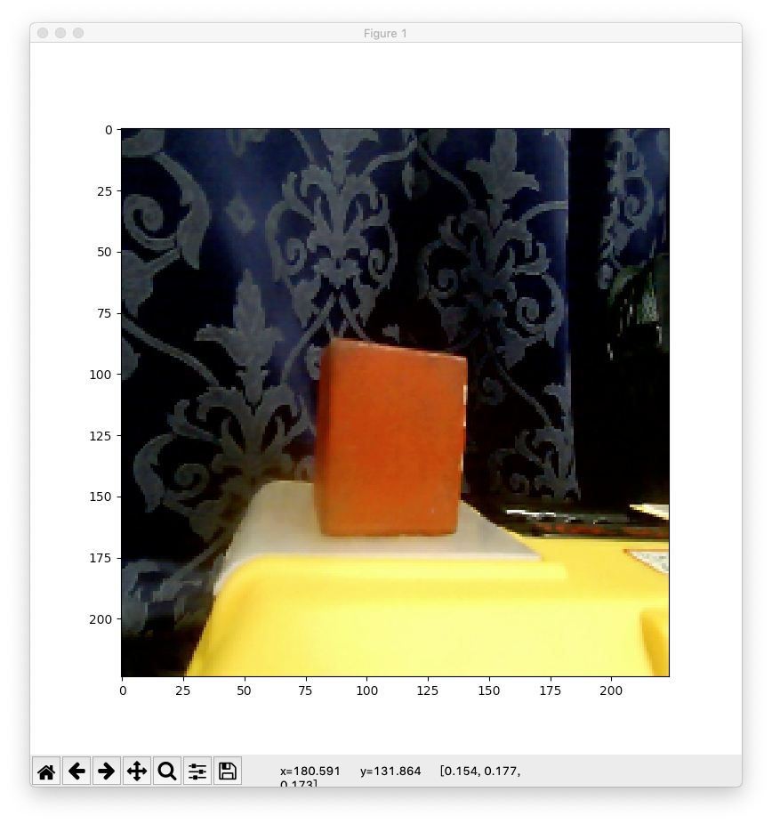
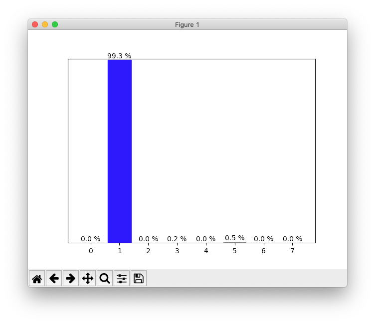
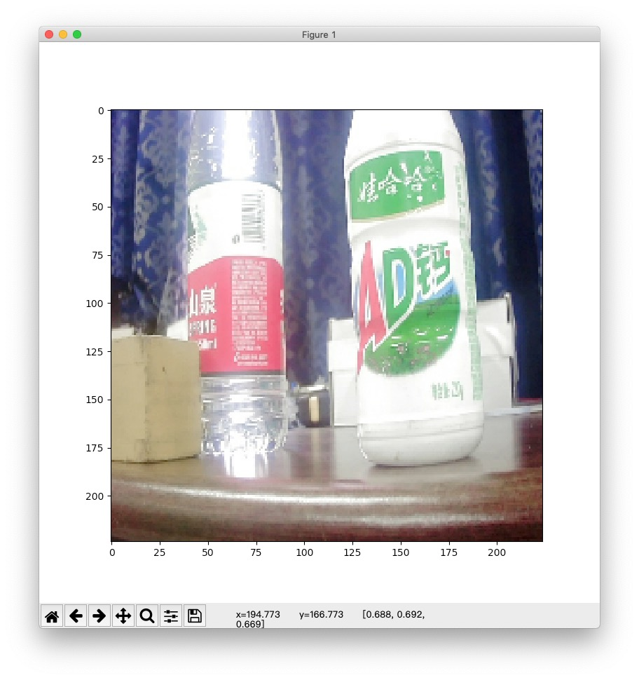
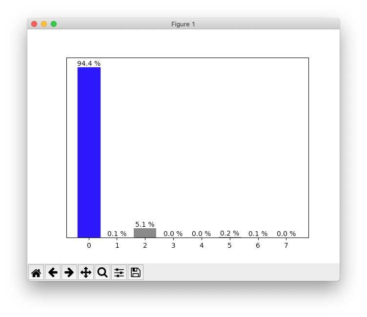

# big_object_recognition
 
不断优化中的物体识别 repo

目前支持的物体识别：[ AD 钙，红木块，红牛，蓝木块，绿木块，魔方，网球，雪花啤酒 ]

该仓库可训练和测试，验证集 accuracy: 100%



### 测试模型

目前 ***最新模型*** 保存在 ```training_res/model_mobilenetv2_2```，测试步骤如下：

1. 将要测试的图片放入 ```picture/test/``` 目录下，简单命名。

2. 修改 ```test.py``` 中 ```if __name__ == "__main__": ``` 后的 ```img_path``` 变量值为测试图片路径。

3. 运行。















---

### 训练模型

更改 ```train.ipynb``` 中的内容。

